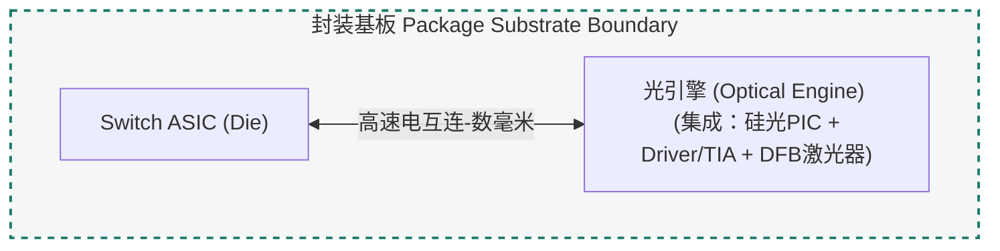
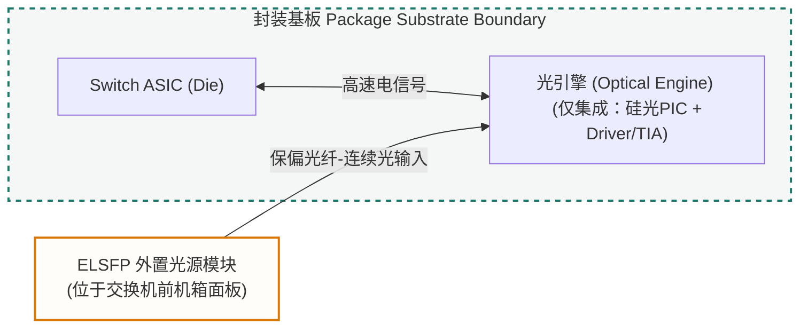

import TermNote from "../../components/TermNote.astro";

## 本页回答的问题

在 CPO 系统中，“光源系统”指为光引擎提供连续光功率的系统安排。它的核心问题不是单颗激光器如何发光，而是连续光由哪个器件产生、激光器位于封装边界的哪一侧，以及这束光如何进入 optical engine 并成为 PIC / 调制器的输入光。

因此，本页先限定系统边界：从 InP / III-V 激光器芯片、<TermNote label="TOSA" note="Transmitter Optical Sub-Assembly，发射端光学子组件，通常把激光器、耦合光学、监控探测器和封装接口组织在一起。" />、<TermNote label="ELSFP" note="External Laser Small Form-Factor Pluggable，OIF 定义的外置光源可插拔形态，用来给光引擎提供连续光。" /> 到 optical engine 输入端。材料、外延、有源区、DFB / EML 等器件细节是后续页面的展开对象，不在本页一次性展开。

本文默认语境是网络交换 CPO：光引擎靠近数据中心交换芯片（<TermNote label="switch ASIC" note="数据中心交换机中的网络交换芯片，不是 GPU / TPU die；本页默认指网络交换 CPO 语境。CPO 把光引擎放到它附近，以缩短 switch ASIC 到光引擎之间的高速电信号路径。" />）。GPU / TPU / XPU 封装中的 optical I/O 也可能采用相近的光电集成思路，但其主芯片类型、封装边界和系统约束不同，后续单独比较。

## CPO 为什么会放大光源问题

CPO 的基本动机是把光引擎放到 switch ASIC 附近，缩短高速电信号路径。但这一集成方式也会放大光源相关问题：

- 硅光 / PIC 擅长处理光，不天然擅长发光。
- switch ASIC 附近热密度高，而激光器对温度、老化和波长漂移敏感。
- 如果激光器放进封装，光路短，但封装、良率、返修更难。
- 如果激光器外置，热和可维护性更好，但光功率预算、连接器、光纤走线、安全和管理变复杂。

因此，CPO 光源问题不只是“哪种激光器更好”，而是系统边界问题：光在哪里产生，如何进入光引擎，进入后如何由 PIC 使用，以及失效后如何定位、隔离和维护。

## 光源位置与系统边界

| 位置 | 例子 | 优点 | 难点 |
|---|---|---|---|
| 光引擎内部 | optical engine with internal laser | 光路短，系统边界直观 | 热、良率、返修、laser aging 压力集中 |
| 封装内 / 封装边缘 | in-package source / laser tile | 靠近 PIC，集成度高 | 封装设计、散热、测试和 known-good-die 更难 |
| 外置光源模块 | external laser source / ELSFP | 远离 ASIC 热源，可维护性更好 | 光功率预算、blind-mate connector、fiber routing、safety、management 更复杂 |
| PIC 上异质集成 | III-V-on-Si / bonded laser | 集成度最高，路径最短 | 工艺整合、可靠性和规模量产难度高 |

在外置光源型 CPO 方案里，光源可以独立于光引擎，作为外置模块提供连续光。但 CPO 不要求光源一定外置；它也可能在光引擎内部、封装内，或更深地集成到 PIC / 硅光平台上。

### 内置与外置方案示意

下面两张图只说明物理位置和连接边界，不代表唯一实现方式。

#### 方案一：内置光源 (Internal Laser)

激光器、电驱动和硅光 PIC 位于同一个光引擎中，光引擎与 switch ASIC 共同处在封装基板边界内：



#### 方案二：外置光源 (External Laser / ELSFP)

外置光源方案将激光器移出封装内的高热密度区域，通过保偏光纤把连续光送入封装内的光引擎：



### 标准语境：ELS 和 ELSFP

在 <TermNote label="OIF" note="Optical Internetworking Forum，光通信行业互操作论坛，常发布 CPO、ELSFP 等实现协议、框架和白皮书。" /> 的管理白皮书里，ELS（external light source）是提供光的外部光模块；在 CPO 场景下，它向不带内部光源的 optical engine / optical transceiver 提供光功率。连续光（CW light）从 ELS 输出端口出来，经光纤送到 optical engine；进入光引擎后，才进一步被 PIC / 调制器使用。ELSFP 则是 OIF 为这种外置供光方式定义的一种可插拔实现形态。

## 概念层级边界

理解光源系统时，需要避免把材料、结构、器件和系统边界混为一类。

| 层级 | 例子 | 主要问题 |
|---|---|---|
| 材料平台 | InP / GaAs / III-V-on-Si | 器件建立在何种材料体系上 |
| 有源区 | QW / MQW / QD | 载流子在哪里复合，光增益从哪里产生 |
| 腔体 / 反馈结构 | FP / <TermNote label="DFB" note="Distributed Feedback，分布式反馈激光器或反馈结构，利用沿腔体分布的光栅选择稳定单模波长。" /> / DBR | 光如何被反馈、选模并稳定波长 |
| 器件 / 发射器 | <TermNote label="CW laser" note="Continuous-Wave Laser，连续光激光器，输出未调制的稳定光功率，后续通常由 PIC / 调制器承载数据。" /> / <TermNote label="EML" note="Electro-Absorption Modulated Laser，电吸收调制激光器，常把 DFB 激光器和 EAM 调制器集成在一起。" /> / laser array | 光源或发射器如何实现 |
| 系统供光方式 | internal laser / <TermNote label="external laser source" note="外置光源，把激光器放在光引擎或封装外部，以改善热和可维护性，但会增加连接、功率预算和管理复杂度。" /> / ELSFP | 光在哪里产生，如何送入 optical engine |

DFB 是激光器腔体 / 反馈结构，ELSFP 是外置光源的可插拔形态。一个 ELSFP 模块内部可以使用 DFB laser，但 ELSFP 本身不是 DFB。

## 后续学习路径

下面这条不是单纯的制造流程，而是一条理解链：先理解光为什么能够产生，再理解它如何变成稳定激光，最后理解它如何作为连续光进入光引擎。

| 阶段 | 链路 | 说明重点 |
|---|---|---|
| 材料 / 制造 | In / P raw materials → InP substrate → epitaxy → QW / MQW active region | 激光器建立在何种材料体系上；有源区如何通过外延结构形成 |
| 器件物理 | QW / MQW active region → optical gain → DFB / CW laser chip | 载流子注入如何形成光增益；反馈结构如何实现稳定连续光输出 |
| 系统供光 | laser package or TOSA → ELS / optical engine CW-light input → PIC / modulator | 裸激光芯片如何通过封装、耦合和管理变成可用光源；连续光如何进入光引擎并供 PIC / 调制器使用 |

可以将三段关系简化为：

```text
In / P raw materials — 高纯铟和磷等原料
→ InP substrate — 通信波段 III-V 外延的晶圆底座
→ epitaxy — 在衬底上生长多层半导体结构
→ QW / MQW active region — 限制载流子并提供高效复合区域
→ optical gain — 载流子复合产生并放大光
→ DFB / CW laser chip — 形成稳定波长的连续光激光芯片
→ laser package or TOSA — 把裸芯片变成可接入系统的光源形态
→ ELS / optical engine CW-light input — 把连续光送到光引擎输入端
→ PIC / modulator — 在光引擎内部调制、路由或复用这束光
```

这条链路里，每一层回答的问题不同：

- [InP substrate](../../learn/inp-substrate/)：给通信波段 III-V 外延提供底座。
- [Raw material, ingot, wafer, substrate, and epi-ready wafer](../../learn/raw-material-ingot-wafer-substrate-and-epi-ready-wafer/)：解释原料到晶圆的层级。
- [Optical gain and threshold current](../../learn/optical-gain-and-threshold-current/)：解释 laser 为什么需要增益和阈值。
- [Distributed feedback and wavelength selection](../../learn/distributed-feedback-and-wavelength-selection/)：解释 DFB 怎样稳定波长。
- [InP / DFB laser principle](../../learn/inp-dfb-laser-principle/)：把材料、注入、有源区、受激辐射、波导和 DFB 光栅串成一颗通信激光器。
- [Why semiconductor lasers are temperature-sensitive](../../learn/why-semiconductor-lasers-are-temperature-sensitive/)：解释温度为什么影响波长、阈值和可靠性。

## 关键评估指标

| 指标类别 | 指标 | 说明 |
|---|---|---|
| 光学输出 | output power / wavelength / linewidth | 决定可用光功率、通信窗口和频谱稳定性 |
| 噪声与单模性 | RIN / SMSR | 影响链路噪声、边模抑制和波长纯度 |
| 效率与热稳定 | wall-plug efficiency / PCE / temperature sensitivity | 决定系统功耗、散热压力和温度漂移 |
| 可靠性 | lifetime / burn-in / aging | 决定长期运行能力和早期失效筛选方式 |
| 系统集成 | coupling loss / serviceability / management | 决定光从光源到 PIC 的损耗、可维护性和管理复杂度 |

## 继续阅读

这些问题后续会逐步展开：

- 为什么 PIC 通常需要连续光（CW laser）？
- 外置光源为什么会带来管理和安全问题？
- 一颗 InP laser chip 从衬底到有源区怎么形成？
- [InP / DFB laser principle](../../learn/inp-dfb-laser-principle/)。
- ELSFP 为什么被设计成可插拔供光模块？
- 激光器老化、burn-in 和现场可靠性怎么判断？

## 资料来源

- [OIF: External Laser Small Form Factor Pluggable Implementation Agreement](https://www.oiforum.com/wp-content/uploads/OIF-ELSFP-01.0.pdf)
- [OIF: Management of External Light Sources and Co-Packaged Optical Engines](https://www.oiforum.com/wp-content/uploads/OIF-MGT-Co-Packaging-ELSFP-01.0.pdf)
- [OIF: Co-Packaging Framework Document](https://www.oiforum.com/wp-content/uploads/OIF-Co-Packaging-FD-01.0.pdf)
- [Frontiers of Optoelectronics: Co-packaged optics status, challenges, and solutions](https://link.springer.com/article/10.1007/s12200-022-00055-y)
- [Furukawa Electric: Development of an External Laser Source for Co-Packaged Optics](https://www.furukawaelectric.com/en/rd/review/fr055/10.html)
