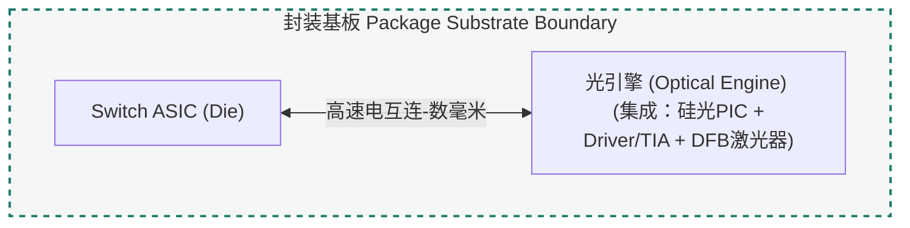
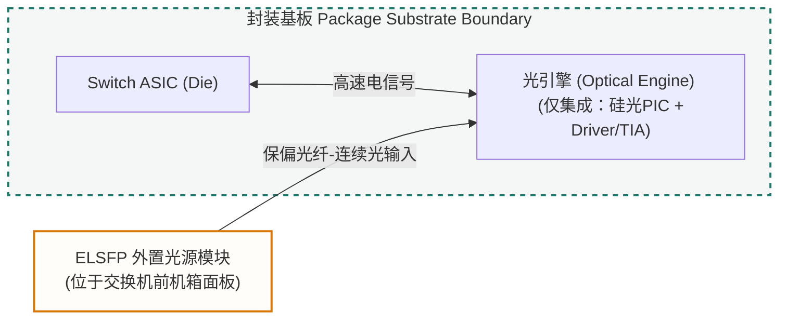

import TermNote from "../../components/TermNote.astro";

## 本页定位

本页讨论 CPO 光源系统的两层问题：激光器怎样从材料和器件结构中产生稳定连续光；这颗激光器芯片经过封装、耦合和系统管理后，怎样成为光引擎可使用的供光单元。

技术路径从 InP / III-V 材料为什么能够发光开始，经过衬底、外延、有源区、波导、腔体和 DFB 光栅，再延伸到裸激光器芯片如何被组织为 <TermNote label="TOSA" note="Transmitter Optical Sub-Assembly，发射端光学子组件，通常把激光器、耦合光学、监控探测器 and 封装接口组织在一起。" />、<TermNote label="ELSFP" note="External Laser Small Form-Factor Pluggable，OIF 定义的外置光源可插拔形态，用来给光引擎提供连续光。" /> 或光引擎内部供光结构。封装、耦合和测试的细节会在对应页面展开，本页只保留它们与光源选择直接相关的接口关系。

这里的“光源系统”范围比单颗激光器芯片更大。它同时包括材料和器件物理，也包括光源放在封装内或封装外、如何接入光引擎、如何测试以及如何维护。除非特别说明，本文默认讨论网络交换 CPO：光引擎靠近数据中心交换芯片（<TermNote label="switch ASIC" note="数据中心交换机中的网络交换芯片，与 GPU / TPU die 分属不同语境；本页默认指网络交换 CPO。CPO 把光引擎放到它附近，以缩短 switch ASIC 到光引擎之间的高速电信号路径。" />）。GPU / TPU / XPU 封装中的 optical I/O 属于相邻路线，后续需要单独比较。

### CPO 光源的自底向上技术栈模型

理解 CPO 光源需要沿着一条从底层物理原材料到顶层系统级集成架构的路径。我们将这一路径划分为六层硬件技术栈：

| 层级 | 阶段名称 | 技术核心与关注点 |
| :--- | :--- | :--- |
| **第一层：原材料层** | InP 衬底与材料物理 | 利用 III-V 族直接带隙发光特性，制备 epi-ready 磷化铟衬底作为外延底座。 |
| **第二层：外延生长** | MQW 有源区与异质结 | 通过 MOCVD 生长多量子阱，形成限制层与载流子限制，实现电光转换。 |
| **第三层：器件物理** | 波导与 DFB 光栅 | 建立脊波导（Waveguide）或埋入异质结构，依靠分布式反馈实现稳定单模激射。 |
| **第四层：后道加工** | 芯片测试与解理 | 对整张晶圆进行解理（Cleaving）、端面镀膜与已知合格芯片（KGD）筛选。 |
| **第五层：封装组件** | TOSA / ELSFP / 耦合 | 完成裸芯片到实用发射组件的组织，解决光纤耦合与热电控制问题。 |
| **第六层：系统集成** | CPO 架构与链路 | 解决内置与外置光源的选择、光功率预算、走线以及可维护性难题。 |

## 为什么 CPO 需要稳定光源

CPO 的基本动机是把光引擎放到 switch ASIC 附近，缩短高速电信号路径。但光引擎靠近高功耗芯片后，光源问题会被放大：

- 硅光 / PIC 擅长传输、路由、调制和复用光，不天然擅长发光。
- 激光器对温度、老化、反射和波长漂移敏感，而 switch ASIC 附近热密度较高。
- 如果激光器放进封装，光路较短，但封装、良率、返修和 known-good-die 判断更困难。
- 如果激光器外置，热和可维护性更好，但连接器、光纤走线、功率预算、安全和管理更复杂。

因此，CPO 光源不是单纯的器件选择问题。先理解激光器本身如何从材料、外延和芯片工艺中形成，才能进一步讨论它如何被封装、测试和接入光引擎。

## 总览：从 InP 衬底到激光器芯片

下面是一份制造阶段总览：每一阶段既包含工艺动作，也对应形成的关键器件结构。在半导体激光器行业中，制造工艺通常以晶圆前道（Wafer Level）与芯片后道（Die Level）为界线进行划分：

- **前道工艺 (Wafer Level)**：包含阶段 1 至阶段 4，在整张磷化铟晶圆上进行，具有极高的规模化集成效率。
- **后道与封装集成 (Die Level & Packaging)**：包含阶段 5 至阶段 6，将晶圆分割为独立器件，并完成从裸芯片到系统级光源的封装与接入。

<ol className="stage-list">
  <li>
    <strong>InP 单晶生长与衬底制备</strong>
    <span>从高纯 In / P 原料制备多晶 InP，再生长单晶晶锭，并经过切片、研磨、抛光和 CMP，得到 epi-ready InP 衬底。</span>
  </li>
  <li>
    <strong>外延生长</strong>
    <span>在 InP 衬底上生长多层 III-V 半导体结构，形成 cladding、SCH、QW / MQW 有源区和接触层。</span>
  </li>
  <li>
    <strong>光栅与波导加工</strong>
    <span>通过光刻、刻蚀、再生长或相关工艺形成 DFB 光栅、ridge waveguide 或 buried heterostructure，用来限制光场并提供反馈。</span>
  </li>
  <li>
    <strong>电极、绝缘与电流限制</strong>
    <span>形成 p/n contact、金属电极、钝化层和电流限制结构，使载流子能够被控制地注入有源区。</span>
  </li>
  <li>
    <strong>解理与端面处理</strong>
    <span>把晶圆加工成 laser bar / laser chip，并进行端面镀膜，控制反射、输出耦合和端面可靠性。</span>
  </li>
  <li>
    <strong>芯片测试与筛选</strong>
    <span>测试阈值电流、输出功率、光谱、SMSR、RIN 和老化表现，筛选可进入后续封装或系统集成的激光器芯片。</span>
  </li>
</ol>

后续各节沿这条主线展开。TOSA、ELSFP、光引擎输入和 PIC 接入属于封装与系统集成层面的内容，本页只在必要处说明它们与激光器芯片的关系。

## 材料层：为什么是 InP / III-V

通信光源通常依赖 III-V 族半导体材料体系。原因在于它需要同时满足发光效率、波长范围、外延兼容性和器件可靠性。

| 主题 | 要点 |
|---|---|
| 直接带隙 | InP 相关 III-V 材料体系适合高效辐射复合。 |
| 通信波段 | InGaAsP / InAlGaAs 等有源区材料可以覆盖 1310 nm 和 1550 nm 附近通信窗口。 |
| 衬底平台 | InP 可以作为通信波段激光器的衬底、包层和外延平台。 |
| 异质集成 | 在硅光系统中，InP / III-V 通常负责发光，Si / SOI 更适合低损耗波导和大规模无源/调制结构。 |

### CPO 场景下的材料选型与温度挑战

在传统可插拔光模块中，激光器工作在 0℃ ~ 70℃ 的模块内部。而在 CPO 场景下，光引擎极其靠近散发巨大热量的 Switch ASIC，环境温度高达 80℃ ~ 100℃。

这直接推动了有源区材料体系的演进：
- **InGaAsP (铟镓砷磷)**：传统的发光材料。在高温下，其导带偏移较小，电子极易从量子阱中泄漏出来，导致阈值电流急剧上升，发光效率大幅衰减。
- **InAlGaAs (铝铟镓砷)**：CPO 光源的优选材料体系。它具有更大的导带偏移（Conduction Band Offset），能够强力束缚高温下的注入电子。在 85℃ 甚至更高温度下，InAlGaAs 激光器依然保持高输出功率与低温漂。这一底层材料特性直接决定了 CPO 是需要强 TEC 降温还是能够支持无 TEC（uncooled）工作。

## 晶圆与外延：结构如何长出来

激光器的微观结构通过外延在衬底上形成多层半导体结构。后续会继续补充每一步的工艺窗口和缺陷控制。

```text
high-purity In / P — 高纯铟和磷等原料
→ polycrystalline InP — 多晶 InP 合成
→ single-crystal InP ingot — 单晶 InP 晶锭
→ wafer slicing / lapping / polishing / CMP — 切片、研磨、抛光和平坦化
→ epi-ready InP substrate — 通信波段 III-V 外延的晶圆底座
→ MOCVD / MBE epitaxy — 外延生长多层半导体结构
→ cladding / SCH / MQW / contact layers — 形成包层、限制层、有源区和接触层
```

| 层级 | 作用 |
|---|---|
| InP substrate | 提供晶格匹配和机械支撑，是外延层生长的底座。 |
| cladding layer | 通过折射率差限制光场，并提供电流注入路径。 |
| SCH layer | separate confinement heterostructure，用于约束光场和载流子。 |
| QW / MQW active region | 电子和空穴复合并产生光增益的核心区域。 |
| contact layer / metal | 把外部电流注入半导体结构。 |

## 有源区：电流如何变成光增益

半导体激光器通常是电泵浦器件。外部电流先注入电子和空穴；电子和空穴在有源区复合，释放出的能量形成光子。

有源区通常采用 QW / MQW 结构，以便把载流子限制在较薄区域内，提高复合效率和光增益。当注入带来的增益超过器件内部损耗和输出损耗时，激光器进入阈值以上工作状态，输出稳定激光。

## 激光器内部微观结构

后续 3D 模型应优先服务这一节：读者需要看到电流路径、光场路径、量子阱位置、波导约束和反馈结构之间的空间关系。

| 微观结构 | 说明 |
|---|---|
| p-contact / metal | 连接外部电极，把电流送入 p 侧。 |
| p-InP / n-InP cladding | 提供电流注入路径，并通过折射率差帮助约束光场。 |
| SCH layer | 位于包层和有源区之间，改善光场与载流子限制。 |
| MQW active region | 光增益产生区域，是激光器最关键的薄层结构。 |
| ridge waveguide | 限制横向电流和光场，使模式集中在有源区附近。 |
| facet / coating | 决定端面反射、输出耦合和可靠性风险。 |

## DFB 如何选择波长

<TermNote label="DFB" note="Distributed Feedback，分布式反馈激光器或反馈结构，利用沿腔体分布的光栅选择稳定单模波长。" /> 属于激光器腔体 / 反馈结构。材料名称和有源区名称属于其他层级。DFB 通过沿传播方向分布的光栅提供反馈，使满足 Bragg 条件的波长获得更强选择性。

与只依赖两个端面形成腔体的 Fabry-Perot 激光器相比，DFB 激光器更容易获得稳定单模输出。后续需要补充 Bragg wavelength、grating coupling coefficient、SMSR 和温度漂移之间的关系。

### CPO 链路中的反射敏感性 (Reflection Sensitivity)

在自底向上的光路中，DFB 激光器对微小的外部反射光（Reflection）都极其敏感。微弱的回授光会进入 DFB 谐振腔，破坏布拉格光栅选择的单一波长，导致光谱展宽、激射模式不稳定，并大幅度增加相对强度噪声（RIN）。

在 CPO 系统中：
- 如果使用**外置光源 (ELSFP)**，光需要通过保偏光纤、盲插光连接器（Blind-mate connector）才能接入封装内的光引擎。连接器接触面、光纤弯曲处的反向反射光会回授至激光器，破坏整个链路的传输指标。
- 解决这一底层物理问题的方案是在光路中引入**光隔离器 (Optical Isolator)**，允许光单向通过，阻断反射光。这增加了 ELSFP 模块或 TOSA 的组装难度和制造成本。

## 从 laser chip 到可用光源

裸激光器芯片不能直接等同于系统光源。它还需要经过测试、封装、耦合、热控制和监控，才能成为 CPO 系统可使用的连续光源。

| 环节 | 作用 |
|---|---|
| chip test / burn-in | 筛除早期失效，评估输出功率、阈值、电压和光谱稳定性。 |
| TOSA / laser package | 把裸芯片、耦合光学、监控探测器和封装接口组织成可用发射组件。 |
| monitor PD / control loop | 监测输出功率并辅助闭环控制。 |
| TEC / thermistor | 控制或监测温度，降低波长漂移和功率漂移。 |
| fiber / lens coupling | 把芯片输出光耦合到光纤、光波导或 optical engine 输入端。 |

## CPO 里的光源放置方式

| 位置 | 例子 | 优点 | 难点 |
|---|---|---|---|
| 光引擎内部 | optical engine with internal laser | 光路短，系统划分直观 | 热、良率、返修、laser aging 压力集中 |
| 封装内 / 封装边缘 | in-package source / laser tile | 靠近 PIC，集成度高 | 封装设计、散热、测试和 known-good-die 更难 |
| 外置光源模块 | <TermNote label="external laser source" note="外置光源，把激光器放在光引擎或封装外部，以改善热和可维护性，但会增加连接、功率预算和管理复杂度。" /> / ELSFP | 远离 ASIC 热源，可维护性更好 | 光功率预算、blind-mate connector、fiber routing、safety、management 更复杂 |
| PIC 上异质集成 | III-V-on-Si / bonded laser | 集成度最高，路径最短 | 工艺整合、可靠性和规模量产难度高 |

在 <TermNote label="OIF" note="Optical Internetworking Forum，光通信行业互操作论坛，常发布 CPO、ELSFP 等实现协议、框架和白皮书。" /> 的管理白皮书里，ELS（external light source）是提供光的外部光模块；在 CPO 场景下，它向不带内部光源的 optical engine / optical transceiver 提供光功率。ELSFP 则是 OIF 为这种外置光源定义的一种可插拔实现形态。

### 内置与外置方案示意

下面两张图只说明物理位置和连接关系，不代表唯一实现方式。

#### 方案一：内置光源 (Internal Laser)



#### 方案二：外置光源 (External Laser / ELSFP)



## 评价指标

| 指标类别 | 指标 | 说明 |
|---|---|---|
| 光学输出 | output power / wavelength / linewidth | 决定可用光功率、通信窗口和频谱稳定性。 |
| 噪声与单模性 | RIN / SMSR | 影响链路噪声、边模抑制和波长纯度。 |
| 电热效率 | threshold current / slope efficiency / wall-plug efficiency / PCE | 决定系统功耗和散热压力。 |
| 温度稳定性 | wavelength drift / output power drift | 决定温度变化下的波长和功率稳定性。 |
| 可靠性 | lifetime / burn-in / aging / COD | 决定长期运行能力和早期失效筛选方式。 |
| 系统集成 | coupling loss / serviceability / management | 决定光从光源到 PIC 的损耗、可维护性和管理复杂度。 |

## 总结：一颗光源从哪里来

CPO 光源系统可以从两个方向同时理解：向下看，它依赖 InP / III-V 材料、外延、有源区、波导、腔体和 DFB 反馈结构；向上看，它必须通过封装、耦合、测试、热管理和系统管理，变成 optical engine 能长期使用的连续光输入。

相关参考页会继续保留，用于补充已有内容：[InP substrate](../../learn/inp-substrate/)、[Optical gain and threshold current](../../learn/optical-gain-and-threshold-current/)、[Distributed feedback and wavelength selection](../../learn/distributed-feedback-and-wavelength-selection/)、[InP / DFB laser principle](../../learn/inp-dfb-laser-principle/)。

## 资料来源

- [OIF: External Laser Small Form Factor Pluggable Implementation Agreement](https://www.oiforum.com/wp-content/uploads/OIF-ELSFP-01.0.pdf)
- [OIF: Management of External Light Sources and Co-Packaged Optical Engines](https://www.oiforum.com/wp-content/uploads/OIF-MGT-Co-Packaging-ELSFP-01.0.pdf)
- [OIF: Co-Packaging Framework Document](https://www.oiforum.com/wp-content/uploads/OIF-Co-Packaging-FD-01.0.pdf)
- [Frontiers of Optoelectronics: Co-packaged optics status, challenges, and solutions](https://link.springer.com/article/10.1007/s12200-022-00055-y)
- [Furukawa Electric: Development of an External Laser Source for Co-Packaged Optics](https://www.furukawaelectric.com/en/rd/review/fr055/10.html)
