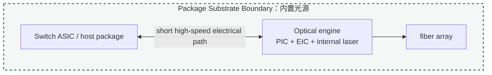
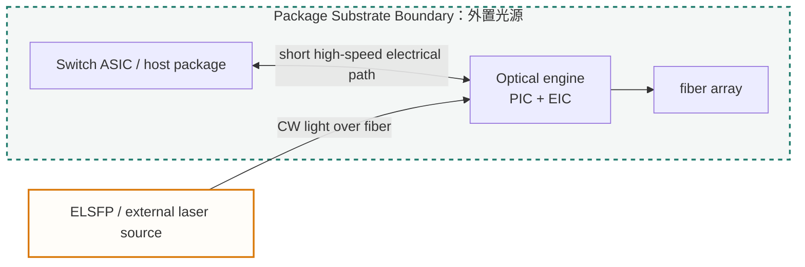

import TermNote from "../../components/TermNote.astro";

## 封装集成先定义系统边界

<TermNote label="Package integration" note="封装集成。它把多颗裸 die、光学接口、封装基板、散热结构和测试边界组织成一个可装配、可测试、可长期运行的产品形态。" /> 把 laser、PIC、EIC、fiber array、substrate / interposer、散热结构和测试边界组织成产品形态。它先回答哪些东西进入同一 package，哪些留在 board、front panel 或 field-replaceable module，随后才讨论材料和工艺。

CPO 的基本动机是把 optical engine 移到 <TermNote label="switch ASIC" note="数据中心交换机中的网络交换芯片，负责端口之间的数据转发；CPO 语境下，光引擎靠近它以缩短高速电互连路径。" /> 附近，缩短高速电路径。这个动作把传统 pluggable module 里的很多边界压进封装内部：高速互连、fiber escape、laser heat、PIC drift、mechanical stress、known-good-die、rework 和 package-level test 会在同一张集成图里互相约束。

```text
Switch ASIC / host package
→ high-performance substrate or interposer
→ EIC / driver / TIA
→ PIC / modulator / PD / MUX
→ laser source or external CW light input
→ fiber array / connector / optical I/O
→ heat spreader / lid / cold plate / chassis
```

激光源见 [激光源](../laser-source/)；片上光路见 [PIC / optical circuit](../pic/)；driver、TIA 和电接口见 [EIC / driver and receiver](../eic/)；fiber array 与 coupler 见 [Optical I/O / fiber coupling](../optical-io/)；KGD、package-level test 和量产筛选见 [Manufacturing and test](../manufacturing-test/)。

相关基础页：[Why photonic packaging is hard](../../learn/why-photonic-packaging-is-hard/)、[Inside a transceiver](../../learn/inside-a-transceiver/)、[SOI and Photonics-SOI](../../learn/soi-and-photonics-soi/)。

## CPO 封装是一组架构选择

ASIC Host Boundary 决定 optical engine 靠近 host 到什么程度，也决定返修和测试责任。OIF CPO framework 把 co-packaging 放在 host ASIC 附近的 first-level substrate 语境中讨论，目标是降低高速电通道损耗和阻抗不连续。

| 边界形态 | 典型结构 | 收益 | 约束 |
|---|---|---|---|
| Soldered CPO engine | optical engine 直接焊接到共同 substrate | 路径短、密度高、寄生可控 | 返修难、KGD 压力高、封装级良率敏感 |
| Socketed engine | engine 通过 LGA / socket / retention 结构接入 | 可装配、可替换，适合试产和返修 | 机械结构占面积，接触可靠性和通道密度受限 |
| Near-package optics | engine 靠近 ASIC package，保留独立装配边界 | 封装风险较低，维护空间较多 | 电路径长于深度 CPO，功耗收益较小 |
| Pluggable optics | front-panel module | 可维护，生态成熟 | PCB 高频损耗和前面板密度压力更大 |

传统路径是 `switch ASIC -> PCB traces -> front-panel connector -> pluggable optical module -> fiber`。CPO 路径把 optical engine 拉近到 common substrate / interposer 或 near-package substrate。封装架构的差异，本质上是在电路径长度、接触可靠性、封装面积、retention 结构、KGD 压力和 field service 之间分配成本。

## Floorplan：电最短、光可出、热可走、力可控

Packaging 的核心章节是 floorplan。每个对象都有理想位置，但这些理想位置互相冲突：

- EIC 希望贴近 PIC 的 modulator electrode 和 PD pad，以降低 RF path loss 和寄生。
- PIC 需要面向 EIC 提供高速 pad / microbump，也要面向 optical I/O 提供 coupler。
- Laser 希望靠近 PIC 以降低光损耗，同时避开高温区域并保留 KGD / replaceability 策略。
- Fiber array 希望靠近 package edge，并保留 bend radius、strain relief、清洁和出纤空间。
- Switch ASIC 希望 optical engine 围绕它高密度排布，冷板和 lid 希望热路径短、直、接触稳定。

```text
                 heat spreader / lid
                         |
Switch ASIC - substrate / interposer - EIC
                                      | microbump / RF pads
                                    PIC - edge coupler - fiber array
                                      |
                         internal laser or external CW input
```

这个 floorplan 需要同时满足电、光、热、力和测试。为了让 EIC 靠近 PIC，可能会把热源放到光子器件旁边；为了让 fiber array 靠近 coupler，可能会压缩 heat sink 或 retention frame；为了让 laser 可替换，可能会增加 connector loss 和管理复杂度。封装设计的成熟度体现在这些冲突是否被量化，以及目标速率、散热、良率和维护边界是否仍有余量。

## 基板与中介层把密度、供电和装配窗口放在同一层

Package substrate 是 CPO 的底层交通层，承载电源、地、高速差分线、控制信号、测试点和机械安装。<TermNote label="Interposer" note="中介层，位于芯片与封装基板之间，用更细线宽 / 间距、TSV、RDL 或 bridge 等结构提供高密度 die-to-die 互连，再把接口过渡到封装基板。" />、bridge、fan-out / RDL 和 engine substrate 用来提高局部互连密度，并把细 pitch microbump 过渡到系统可装配尺度。

| 层级 | 主要作用 | CPO 关注点 |
|---|---|---|
| Organic package substrate | 电源、地、高速线、BGA / LGA、机械支撑 | 大面积和成熟度较好；line / space 和 pitch 限制更强 |
| Silicon interposer | 高密度 die-to-die routing、TSV、细 pitch 过渡 | 密度高；成本、热、应力和面积需要权衡 |
| Bridge / local interconnect | 局部高密度互连 | 适合关键 die 间短通道；布局和装配流程相关 |
| Fan-out / RDL | 重布线与 pitch 过渡 | 有利于多 die 重布线；翘曲、热和光学装配窗口要控制 |
| Engine substrate | 承载 PIC / EIC / laser 的小基板 | 直接影响 RF 路径、laser attach、fiber attach 和预组装测试 |

Flip-chip、microbump、copper pillar 和 underfill 服务于同一个目标：在更短距离内提供更多 I/O。它们也会把机械材料带到光学器件旁边。bump pitch、standoff、coplanarity、underfill modulus、CTE、electromigration 和 keepout zone 会共同影响 RF 性能、焊点可靠性、PIC 应力和 fiber alignment。

## 热-机械-光电耦合会改变器件表现

CPO 把多个热源放在同一区域：switch ASIC、EIC、laser、PIC heater 和 power delivery 都会改变温度场。热路径可以简化为：

```text
die junction
→ die attach / bumps / underfill / backside
→ substrate / interposer / heat spreader
→ TIM
→ lid / cold plate / heat sink
→ airflow or liquid loop
```

| 热源或应力源 | 封装关注点 | 可能影响 |
|---|---|---|
| Switch ASIC | 高热通量、冷板接触、lid planarity | 限制 optical engine 放置区域和局部温度场 |
| EIC | driver / TIA 发热，贴近 PIC | 调制器漂移、PD 噪声、RF 性能和 bump 可靠性 |
| Laser | 结温、热阻、输出功率和老化 | 波长漂移、PCE 下降、RIN 和寿命余量 |
| PIC heater | 调谐功耗、热串扰、反馈控制 | WDM channel drift、ring lock、startup calibration |
| Underfill / epoxy / solder | CTE、固化收缩、模量和热循环 | solder fatigue、PIC stress、warpage、coupling drift |
| Fiber attach | 光纤弯曲、拉力、胶材和端面 | 插损变化、return loss、长期机械稳定性 |

光子封装的机械应力会直接变成光学问题。微小位移能改变 edge coupler loss；局部应力能改变 waveguide effective index；underfill 或 epoxy 固化收缩能改变 fiber array 与 coupler 的相对位置；socket retention force 能改变 LGA 接触，也能改变 substrate 平整度。热、机械和光学要在同一个验证闭环里处理。

## 光源与出纤边界：内置、外置、可替换的代价

光源和出纤位置是封装架构选择。光源可以在 optical engine 内部、封装边缘、独立 laser tile、PIC 异质集成区域，或外置 ELS / ELSFP 模块中。

| 光源放置 | 主要收益 | 主要代价 |
|---|---|---|
| 光引擎内部 | 光路短，连接器少，集成边界清晰 | laser 受 ASIC / EIC 热影响，KGD 与返修压力集中 |
| 封装边缘或 laser tile | 兼顾短光路和局部热隔离 | 光耦合、热沉、测试和装配流程更复杂 |
| 外置 ELS / ELSFP | 光源远离 ASIC 热源，可现场更换，便于独立管理 | 连接器、偏振、反射、安全、fiber routing 和光功率预算更复杂 |
| III-V-on-Si / bonded laser | 光路最短，集成度高 | 工艺整合、可靠性、热和规模量产难度高 |





Fiber array 与 optical I/O 在封装页只承担系统边界：出纤方向、package edge、fiber bend radius、strain relief、blind-mate connector、cleaning access 和 front-panel / chassis routing。Edge / grating / lens 的细节由 Optical I/O 页面展开。

## 装配、KGD 与返修：良率从哪里损失

CPO 封装的经济风险来自高价值部件聚集。switch ASIC、PIC、EIC、laser、fiber array、substrate 和 assembly 都有自身良率；这些良率会在封装级累乘。

```text
package yield
≈ ASIC yield
× PIC KGD yield
× EIC KGD yield
× laser KGD yield
× substrate yield
× assembly yield
× optical alignment yield
× package-level test yield
```

这个式子用于说明 KGD 的意义。封装越贵、返修越难，封装前筛选越重要。PIC 需要 wafer-level optical test 和 die sort；EIC 需要电学、高速和管理接口测试；laser 需要功率、光谱、RIN、SMSR、热和 burn-in 分档；fiber array 和 optical subassembly 需要插损、几何和端面质量检查。

| 结构 | 返修能力 | 良率含义 |
|---|---|---|
| soldered engine | 返修空间有限，拆卸风险高 | 依赖 KGD、装配良率和 package-level test 覆盖 |
| socketed engine | 可替换性较好 | retention、接触可靠性和面积换取返修能力 |
| external laser / ELSFP | 光源可现场更换 | laser 良率与主封装解耦，光连接和管理更复杂 |
| pre-assembled optical engine | 可在进入 ASIC package 前测试 | engine 成为可筛选子组件，增加子装配流程 |

成熟制造依赖数据闭环：wafer map、bump inspection、fiber alignment log、thermal test、BER / eye data、failure analysis 和 field return 数据要能回到设计规则、工艺窗口和供应链分档。

## 接口合同：封装交给相邻团队哪些指标

封装页的收束点是一组接口合同。每个接口都有几何、电学、光学、热学和可靠性条件。

| 接口 | 典型指标 | 交给谁 |
|---|---|---|
| ASIC ↔ substrate / interposer | channel loss、return loss、crosstalk、power integrity、BGA / LGA pitch | host / ASIC / board |
| EIC ↔ PIC | RF path length、impedance、bump pitch、pad capacitance、ground return、skew | EIC 与 PIC |
| PIC ↔ fiber array | coupling loss、alignment tolerance、PDL、back reflection、pitch、thermal drift | Optical I/O |
| laser ↔ PIC | coupled power、PER、reflection tolerance、thermal resistance、wavelength margin | 激光源、PIC、operations |
| package ↔ thermal solution | thermal resistance、junction temperature、hot spot、TIM void、lid flatness | system thermal |
| package ↔ mechanical system | warpage、CTE match、shock / vibration、strain relief、socket force | mechanical / reliability |
| package ↔ test / operations | KGD coverage、monitor telemetry、fault isolation、rework path、field replaceability | Manufacturing/Test 与 Reliability |

## 总结：Package integration 的判断标准

Package integration 是 CPO 光引擎的空间、互连、散热、机械、良率和可维护性层。判断封装方案时，应看它能否在目标速率、光功率预算、热路径、机械稳定、KGD、返修和现场服务之间留下工程余量。

进一步阅读：

- [OIF: Co-Packaging Framework Document](https://www.oiforum.com/wp-content/uploads/OIF-Co-Packaging-FD-01.0.pdf)
- [OIF: External Laser Small Form Factor Pluggable Implementation Agreement](https://www.oiforum.com/wp-content/uploads/OIF-ELSFP-01.0.pdf)
- [OIF: Management of External Light Sources and Co-Packaged Optical Engines](https://www.oiforum.com/wp-content/uploads/OIF-MGT-Co-Packaging-ELSFP-01.0.pdf)
- [Amkor: Flip Chip Packaging](https://amkor.com/wp-content/uploads/2018/02/Flip_Chip_TS102.pdf)
- [Amkor: Copper Pillar Flip Chip](https://amkor.com/wp-content/uploads/2018/02/Copper_Pillar_Flip_Chip_TS106.pdf)
- [ASE: Silicon Photonics](https://ase.aseglobal.com/silicon-photonics/)
- [ASE: 2.5D and 3D IC Packaging](https://ase.aseglobal.com/3d-ic-packaging/)
