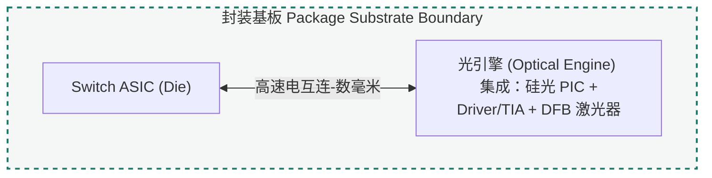
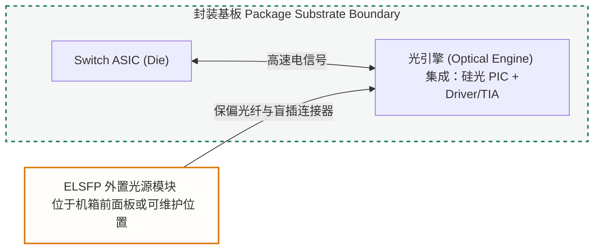

## What This Component Does

Package integration 把多个芯片和光学接口变成可工作的光引擎。它属于 CPO 成败的核心环节。

它处理的问题包括：

- switch ASIC host boundary。
- laser / PIC / EIC placement。
- die attach and flip-chip。
- interposer and package substrate。
- fiber array and lens alignment。
- edge coupling or grating coupling。
- thermal path。
- mechanical stress。
- rework and yield。

## ASIC Host Boundary

CPO 里的 package integration 需要先回答一个边界问题：optical engine 到底放在 switch ASIC 的哪个位置关系上。

传统可插拔模块的路径通常是：

- switch ASIC。
- package substrate。
- PCB high-speed traces。
- front-panel pluggable module。
- fiber。

CPO 把 optical engine 移到 ASIC 附近，目标是缩短高速电信号路径，降低电损耗和功耗，提高带宽密度。

这不等于“ASIC 和 PIC 一定直接封成一颗东西”。实际方案可能是 ASIC 与 optical engine 在同一个封装生态里，也可能通过 socket、tile、substrate 或可维护结构靠近集成。

一个更实用的关系图是：

- Switch ASIC / host package。
- Package substrate or interposer。
- EIC / driver and receiver electronics。
- PIC / optical circuit。
- Optical I/O / fiber coupling。
- Light source / laser supply。

### 光源放置与封装边界

CPO 的光源可以放在光引擎内部、封装边缘，也可以移到外部模块中。这个选择属于封装和系统布局问题，因为它同时改变热路径、光纤走线、连接器、可维修性和光功率预算。

OIF 的 ELS / ELSFP 资料把 external laser source 定义为向 optical engine 或 optical transceiver 提供光功率的外部光模块；ELSFP 是这种外置供光方式的一种可插拔实现形态。

| 放置方式 | 典型形态 | 主要收益 | 主要约束 |
|---|---|---|---|
| 光引擎内部 | optical engine with internal laser | 光路短，系统边界直观 | 热、返修、laser aging 和 KGD 压力集中 |
| 封装内 / 封装边缘 | in-package source / laser tile | 靠近 PIC，集成度高 | 封装设计、散热、测试和良率链更复杂 |
| 外置光源模块 | external laser source / ELSFP | 远离 ASIC 热源，可维护性更好 | 光功率预算、盲插连接器、光纤走线、安全和管理更复杂 |
| PIC 上异质集成 | III-V-on-Si / bonded laser | 路径最短，潜在集成度最高 | 工艺整合、可靠性和规模量产难度高 |

#### 方案一：内置光源的物理集成 (In-Package Integration)

内置方案把激光器裸芯片或 laser tile 放在光引擎附近，可能通过混合集成、共晶焊或封装基板实现。这种方案的光路短，连接器少，但热耦合和返修风险更集中。Switch ASIC、Driver/TIA 和激光器共享更紧密的热环境后，激光器的温度漂移、老化和端面可靠性都需要提前纳入封装设计。

#### 方案二：外置光源模块的物理集成 (External Laser / ELSFP)

外置方案把激光源移出主封装，做成独立模块，通过保偏光纤和盲插光连接器把连续光送入封装内的光引擎。这种方案降低了光源受到 ASIC 热源影响的程度，也提高了现场更换能力；代价是光路更长，连接器和光纤走线会引入损耗、反射、偏振管理和安全管理问题。

## Detail Entrypoints

### Existing Pages

- [Why photonic packaging is hard](../../learn/why-photonic-packaging-is-hard/)
- [Inside a transceiver](../../learn/inside-a-transceiver/)
- [SOI wafer](../../learn/soi-wafer/)
- [LNOI wafer](../../learn/lnoi-wafer/)

### Relevant Physics

- [Waveguides and optical modes](../../learn/waveguides-and-optical-modes/)
- [Interference, resonance, and loss](../../learn/interference-resonance-and-loss/)
- [Why semiconductor lasers are temperature-sensitive](../../learn/why-semiconductor-lasers-are-temperature-sensitive/)

### Later Deep Dives

- Fiber array units (FAU).
- Active and passive alignment.
- Coupling loss and tolerance.
- Known-good-die in package integration.
- Thermal management and heat-sink design.
- CPO package stack.
- EIC / PIC / substrate placement model.

## Common Boundaries

- Packaging is not the same as wafer processing.
- Coupling loss is not only an optical design problem; it is also alignment, assembly and stability.
- CPO reduces some electrical distance but increases package integration pressure.

## Short Version

Package integration is where optical precision, electrical density, thermal design, mechanical stability, testability and yield collide. For CPO, it deserves to be a primary entrance, not a late appendix.
