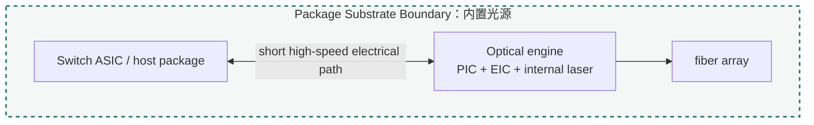
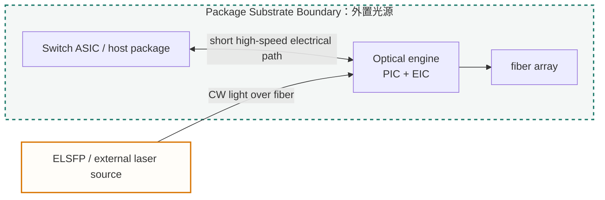

import TermNote from "../../components/TermNote.astro";

## 封装集成的系统边界

<TermNote label="Package integration" note="封装集成。它把多颗裸 die、光学接口、封装基板、散热结构和测试边界组织成一个可装配、可测试、可长期运行的产品形态。" /> 是 CPO 光引擎从芯片集合变成系统部件的关键层。激光源提供连续光，<TermNote label="PIC" note="photonic integrated circuit，光子集成电路，负责片上波导、分光、调制、复用、耦合、监控和探测等光路功能。" /> 组织光路，<TermNote label="EIC" note="electronic integrated circuit，电子集成电路，通常包含 driver、TIA、控制、监测和接口电路。" /> 驱动和读出高速信号，fiber array 把光带出封装，substrate / interposer 承担电连接、机械支撑和部分热路径。封装集成决定这些对象以什么距离、方向、材料和可维修边界结合在一起。

CPO 的基本动机，是把 optical engine 移到 <TermNote label="switch ASIC" note="数据中心交换机中的网络交换芯片，负责端口之间的数据转发；CPO 语境下，光引擎靠近它以缩短高速电互连路径。" /> 附近，缩短高速电路径，降低高频损耗和功耗。这个动作把传统可插拔模块中的许多问题推入封装内部：高速互连长度、microbump pitch、fiber escape、laser heat、PIC thermal drift、mechanical stress、known-good-die、rework 和 package-level test 会在同一张集成图里互相约束。

```text
Switch ASIC / host package
→ high-performance substrate or interposer
→ EIC / driver / TIA
→ PIC / modulator / PD / MUX
→ laser source or external CW light input
→ fiber array / connector / optical I/O
→ heat spreader / lid / cold plate / chassis
```

激光源的材料、外延、DFB 和输出指标见 [激光源](../laser-source/)；PIC 的片上光路见 [PIC / optical circuit](../pic/)；driver、TIA 和电接口见 [EIC / driver and receiver](../eic/)；edge coupler、grating coupler 和 fiber array 的细节见 [Optical I/O / fiber coupling](../optical-io/)；KGD、package-level test 和量产筛选见 [Manufacturing and test](../manufacturing-test/)。

相关基础页：[Why photonic packaging is hard](../../learn/why-photonic-packaging-is-hard/)、[Inside a transceiver](../../learn/inside-a-transceiver/)、[SOI and Photonics-SOI](../../learn/soi-and-photonics-soi/)。

## 为什么 CPO 会提高封装要求

传统 front-panel pluggable optics 把光收发模块放在机箱前面板附近。switch ASIC 到模块之间需要经过 package substrate、PCB 走线、连接器和模块内部电路。随着 lane 速率提高，PCB 高频损耗、SerDes 功耗和前面板密度压力会变大。CPO 把光电转换移到 ASIC 附近，让高速电信号在封装或近封装范围内完成传输，再尽早变成光纤中的光信号。

这个收益带来新的封装难题：

- 光引擎靠近高功耗 ASIC 后，PIC、EIC、laser 和 fiber attach 处在更高热通量和更复杂温度梯度中。
- 高速电路径缩短后，互连会从 PCB 走线变成 package substrate、interposer、microbump、copper pillar 和 short channel 的共同问题。
- 光通道数量增加后，fiber array、connector、optical shuffle、edge / grating coupling 和光纤弯曲半径会直接占用封装与机箱空间。
- 多颗裸 die 进入同一系统后，单颗 die、单个 bump、单条光路和单个粘接点的良率会累乘成封装级良率。
- 光源摆放位置改变后，热、维修、安全、管理和光功率预算会同时变化。

因此，CPO 封装集成的核心任务是管理距离和边界：哪些 die 要足够近，哪些热源要隔开，哪些光学接口要可对准，哪些部件要可替换，哪些测试必须在封装前完成。

## 工作原理：封装怎样把光引擎组织起来

封装集成可以沿一条物理路径理解。它先确定 ASIC 与 optical engine 的边界，再安排 die placement 和高速互连，接着解决光从 laser 到 PIC、从 PIC 到 fiber 的路径，最后用热、机械、测试和返修规则把结构收敛成可量产产品。

<ol className="stage-list">
  <li>
    <strong>先确定 ASIC host boundary</strong>
    <span>封装设计要先回答 optical engine 与 switch ASIC 的关系：在同一 first-level substrate 上、靠近但可插拔、通过 socket 或 LGA 可拆卸、或者在近封装位置通过短铜缆 / 板级互连连接。这个边界决定高速电通道长度、可维修性、封装面积和测试策略。</span>
  </li>
  <li>
    <strong>再安排 PIC、EIC、laser 和 fiber array 的相对位置</strong>
    <span>EIC 需要靠近 PIC 的高速调制器和 photodetector，以降低 RF 损耗和寄生；laser 需要向 PIC 提供稳定连续光，同时避开过高热源；fiber array 需要对准 coupler 并留出弯曲、固定和出纤空间。die placement 是电、光、热、机械共同参与的布局问题。</span>
  </li>
  <li>
    <strong>用 substrate / interposer 承担高密度互连</strong>
    <span>Package substrate 提供电源、地、高速信号、控制信号和机械支撑；silicon interposer、bridge、RDL 或 fan-out 结构可以提高 die-to-die routing density，并把细 pitch microbump 过渡到较粗的 package / board pitch。选择哪种结构，取决于 lane 数、I/O pitch、功耗、成本、良率和可维修边界。</span>
  </li>
  <li>
    <strong>用 flip-chip / microbump 缩短电路径</strong>
    <span>flip-chip 把 die 正面朝下，通过 solder bump、copper pillar 或 microbump 与 substrate / interposer 连接。相较边缘 wire bond，它能把互连分布在 die 表面，缩短电路径，提高 I/O 密度。underfill、standoff、coplanarity、electromigration 和 bump fatigue 会进入可靠性设计。</span>
  </li>
  <li>
    <strong>用 optical I/O 把片上模式接到封装外</strong>
    <span>片上 waveguide mode 很小，fiber mode 更大。edge coupler、grating coupler、lens、spot-size converter 和 fiber array 负责模式转换。对准误差、胶水收缩、热循环、反射、偏振和插损都会影响最终光功率预算。</span>
  </li>
  <li>
    <strong>用热路径和机械结构保持长期稳定</strong>
    <span>ASIC、EIC、laser、heater 和 PD 都会发热。封装需要把热量通过 die attach、TIM、heat spreader、lid、冷板或风冷 / 液冷结构带走，同时控制热梯度和材料热膨胀差异，避免应力拉动 PIC、coupler、fiber array 和 solder joint。</span>
  </li>
  <li>
    <strong>用测试与返修边界控制量产风险</strong>
    <span>封装前要尽量拿到 known-good ASIC、known-good PIC、known-good EIC 和合格 laser；封装后要验证 optical power、eye diagram、BER、thermal drift、monitor loop 和 mechanical stability。可返修结构会占用面积和机械空间，焊接集成密度高但返修难度更大。</span>
  </li>
</ol>

## 1. ASIC Host Boundary：光引擎靠近到什么程度

OIF 的 CPO framework 把 co-packaging 放在 host ASIC 附近的 first-level substrate 语境中理解：optical engine 或 electrical engine 与 ASIC 共享高性能封装生态，目标是降低高速电通道损耗和阻抗不连续。这个定义给封装页提供了最重要的边界：CPO 首先是 host ASIC 与 engine 的物理集成关系。

传统可插拔路径通常是：

```text
switch ASIC
→ ASIC package substrate
→ PCB high-speed traces
→ front-panel connector
→ pluggable optical module
→ fiber
```

CPO 路径把 optical engine 拉近：

```text
switch ASIC
→ common package substrate / interposer / near-package substrate
→ optical engine
→ fiber
```

实际产品可以有多种形态。engine 可以焊接在 co-packaged assembly substrate 上，也可以通过 socket / LGA 类型结构实现装配与拆卸；ASIC 自身可以是封装好的大芯片，也可以与 engine 在同一 MCM 中组合。Near-package optics 还可能把 engine 放在 ASIC package 附近，通过短距离高密度电连接获得一部分 CPO 收益，同时保留更多机械和返修空间。

| 边界形态 | 典型结构 | 收益 | 约束 |
|---|---|---|---|
| Soldered CPO engine | optical engine 直接焊接到共同 substrate | 路径短、密度高、寄生可控 | 返修难、KGD 压力高、封装级良率敏感 |
| Socketed engine | engine 通过 LGA / socket / retention 结构接入 | 可装配、可替换、便于试产和返修 | 机械结构占面积，接触可靠性和通道密度受限 |
| Near-package optics | engine 靠近 ASIC package，但保留独立装配边界 | 封装风险较低，维护空间较多 | 电路径长于深度 CPO，功耗收益较小 |
| Pluggable optics | front-panel 模块 | 可维护、生态成熟 | PCB 高频损耗和前面板密度压力更大 |

ASIC host boundary 还决定了测试责任。engine 焊进共同封装前，PIC、EIC、laser 和 substrate 都要尽可能通过 wafer-level / die-level / subassembly-level test；否则封装后发现一个 lane 失效，可能牵连高价值 ASIC 和整个 package assembly。

## 2. Die placement：PIC、EIC、laser、fiber array 怎样摆放

光引擎布局可以先按四个功能对象分开：

- **EIC**：靠近 PIC 的 modulator electrode 和 PD pad，以降低 RF path loss、capacitance、inductance 和 impedance discontinuity。
- **PIC**：面向 EIC 提供高速 pad / microbump，面向 optical I/O 提供 coupler，面向 laser 提供输入光口。
- **Laser source**：可以在光引擎内、封装边缘、独立 laser tile 或外置 ELSFP 中供光。
- **Fiber array / connector**：需要与 PIC coupler 对准，并把光纤从封装内部引到前面板、背板或机箱光路。

一种紧凑 optical engine 可能把 EIC 叠在 PIC 上方或旁边，通过 microbump 连接高速 Tx/Rx 节点；PIC 的一侧留给 fiber array，另一侧接收 laser input；laser die 或 laser tile 贴在 PIC 附近，通过 lens、turning mirror、edge coupler 或 waveguide interface 供光。另一种结构会把 laser 移到前面板 ELSFP 模块，PIC 只接收由保偏光纤或其他光路送来的 CW light。

```text
                 heat spreader / lid
                         │
switch ASIC ─ substrate / interposer ─ EIC
                                      │ microbump / RF pads
                                    PIC ─ edge coupler ─ fiber array
                                      │
                         internal laser or external CW input
```

die placement 的困难在于每个对象都有不同的“希望位置”。EIC 希望贴近 PIC；fiber array 希望靠近 package edge 并保持光纤弯曲空间；laser 希望靠近 PIC 以减少光损耗，同时远离高温区域；ASIC 希望 optical engine 围绕它高密度排布；heat sink 希望热源路径垂直、短、低热阻。封装设计就是在这些位置诉求之间寻找可制造的组合。

## 3. Substrate / interposer：从细 pitch 到系统互连

Package substrate 是 CPO 的底层交通层。它承载电源、地、高速差分线、控制信号、低速管理、测试点和机械安装。对 CPO 而言，substrate 还要给 optical engine 留出 fiber escape、光源输入、散热器、retention 结构和装配公差。

<TermNote label="Interposer" note="中介层，位于芯片与封装基板之间，用更细线宽 / 间距、TSV、RDL 或 bridge 等结构提供高密度 die-to-die 互连，再把接口过渡到封装基板。" /> 常用于 2.5D / 3D 集成。2.5D 里，多颗 die 并排放在 silicon interposer 或高密度 fan-out / bridge 结构上；3D 里，die 可能上下堆叠，通过 TSV、hybrid bonding 或 microbump 连接。对光引擎而言，interposer 同时影响热路径、机械翘曲、fiber array 可达性和光学 keepout 区域。

| 层级 | 主要作用 | CPO 关注点 |
|---|---|---|
| Organic package substrate | 电源、地、高速线、BGA / LGA、机械支撑 | 大面积、成本和成熟度较好；line/space 和 pitch 限制较强 |
| Silicon interposer | 高密度 die-to-die routing、TSV、细 pitch 过渡 | 互连密度高；成本、面积、热和应力需权衡 |
| Bridge / local interconnect | 局部高密度互连 | 可在关键 die 间提供短通道；布局自由度与装配流程相关 |
| Fan-out / RDL | 重布线与 pitch 过渡 | 适合多 die 重布线；翘曲、热和光学装配窗口需要控制 |
| Engine substrate | optical engine 内部承载 PIC / EIC / laser 的小基板 | 直接影响 RF 路径、laser attach、fiber attach 和预组装测试 |

substrate / interposer 的设计会把电学指标翻译成几何指标：line width / spacing、via stack、reference plane、return path、bump pitch、escape routing、crosstalk 和 power integrity。对 PIC 与 EIC，路径越短越好；对 fiber array 和 laser，机械可达性和对准窗口同样重要。CPO 封装常需要把“电最短路径”和“光可装配路径”同时画进 substrate floorplan。

## 4. Flip-chip、microbump 与 underfill

flip-chip 是把 die 通过表面阵列互连贴到 substrate / interposer 上的封装方法。CPO 光引擎常用这种思路连接 EIC、PIC、engine substrate 或 interposer，因为高速 driver / TIA 节点需要短、密、可控阻抗的电路径。

基本过程可以概括为：

```text
wafer bumping / copper pillar formation
→ die singulation and inspection
→ flip-chip placement
→ solder reflow or thermo-compression bonding
→ underfill dispense / cure
→ electrical and optical inspection
```

<TermNote label="Microbump" note="微凸点。用于先进封装中细 pitch die-to-die 或 die-to-interposer 连接的小型金属凸点，常见材料体系包括 solder bump、copper pillar with solder cap 等。" /> 负责在很小面积内传输高速信号、电源、地、控制和监测信号。copper pillar 通过铜柱加焊料帽形成互连，适合较细 pitch 和较高电流密度场景；underfill 填充 die 与 substrate 之间的间隙，用来分担热循环中的机械应力，并保护 solder joint / bump。

| 变量 | 封装意义 | 对 CPO 的影响 |
|---|---|---|
| bump pitch | 单位面积 I/O 密度 | 决定 EIC / PIC 可并行多少高速 lane 和控制信号 |
| bump height / standoff | die 与 substrate 间距 | 影响寄生、电容、underfill 流动、应力和散热路径 |
| coplanarity | bump 高度一致性 | 影响贴装良率、open / short 风险和返修难度 |
| electromigration | 高电流下金属迁移风险 | 影响供电 bump、heater bump 和长期可靠性 |
| underfill modulus / CTE | 胶材力学与热膨胀特性 | 影响 solder fatigue、PIC 应力、warpage 和光学对准 |
| keepout zone | bump、metal、heater 与 optical path 的避让区 | 影响 PIC 版图、fiber coupler、thermal sensor 和 test pad 放置 |

flip-chip 的价值来自短互连和高密度，但它也把机械材料带到光学器件旁边。underfill 的收缩、热循环后的应力释放、substrate warpage 和 die attach 厚度差异，都可能改变 PIC coupler 与 fiber array 的相对位置，或者让 ring、MZM、AWG 等结构的工作点发生漂移。CPO 封装因此要把电互连可靠性和光路稳定性放在同一个仿真与测试闭环中。

## 5. 光源边界：内置光源、封装边缘与 ELSFP

CPO 的光源可以在 optical engine 内部，也可以放在封装边缘、独立 laser tile 或外置模块中。这个选择属于 package integration，因为它同时改变热路径、光纤走线、连接器、可维护性、laser safety、控制管理和光功率预算。

OIF 的 external laser source 语境把 ELS 理解为向 optical engine 或 optical transceiver 提供连续光功率的外部模块；ELSFP 是其中一种可插拔实现形态。它的层级是外置供光的机械、电气、光学、热、管理和安全边界。

| 光源放置 | 典型形态 | 主要收益 | 主要约束 |
|---|---|---|---|
| 光引擎内部 | laser die / laser array 与 PIC / EIC 同封装 | 光路短，连接器少，集成边界清晰 | laser 受 ASIC / EIC 热影响，KGD 与返修压力集中 |
| 封装边缘或 laser tile | laser tile 贴近 PIC，保持一定热隔离 | 兼顾短光路和局部热设计 | 光耦合、热沉、测试和装配流程更复杂 |
| 外置光源模块 | ELS / ELSFP 通过光纤送 CW light | 光源远离 ASIC 热源，可现场更换，便于独立管理 | 光功率预算、连接器、偏振、反射、安全和光纤布线更复杂 |
| PIC 上异质集成 | III-V-on-Si / bonded laser | 路径最短，集成度高 | 工艺整合、可靠性、热和规模量产难度高 |





### 内置光源的封装逻辑

内置方案把 laser die 或 laser array 放在 optical engine 内。它可以通过 submount、共晶焊、die attach、lens、turning mirror、spot-size converter 或 edge coupler 与 PIC 耦合。短光路有利于降低连接器损耗和外部布线复杂度；laser 与 PIC 的相对位置也能在同一个封装中固定。

热和返修是内置方案的关键压力。laser 的中心波长、阈值、电光效率、RIN 和寿命都对结温敏感；当 laser 接近 ASIC 和 EIC，封装需要给 laser 提供独立可控的热路径，避免它被高功耗芯片的温度场拖动。内置 laser 一旦封进 high-value package，封装前的 laser KGD、burn-in、分档和冗余设计会变得更重要。

### 外置光源与 ELSFP 的封装逻辑

外置方案把 laser 移出主封装，做成 ELS 或 ELSFP 模块，通过光纤和盲插光连接器向 optical engine 送入 CW light。这个边界把 laser 的热管理和现场更换能力移到前面板或可维护位置，也让 optical engine 少承受一部分 laser heat。

代价是光路链条变长。ELSFP 到 optical engine 的路径会引入连接器插损、反射、偏振状态变化、光纤布线空间、光安全和管理问题。系统需要知道哪一路 external light 供给哪颗 optical engine，什么时候打开光、如何检测失光、如何处理故障和替换模块。外置供光因此是 package integration、host-board management 和 operations 的共同边界。

## 6. Fiber array 与 optical I/O：把光稳定带出封装

PIC 上的光学模式通常只有微米级尺寸，而单模光纤的 mode field diameter 大得多。fiber array 与 edge / grating coupler 的作用，是把片上模式和光纤模式在位置、角度、偏振和模式尺寸上匹配起来。

常见封装路径包括：

| 路径 | 结构 | 优势 | 约束 |
|---|---|---|---|
| Edge coupling | PIC 边缘 coupler + fiber array / lensed fiber | 宽带、潜在低损耗、适合高功率和 WDM | 需要芯片边缘质量、精密对准和稳定固定 |
| Grating coupling | 表面 grating + 垂直或倾斜 fiber array | 便于 wafer-level test 和表面访问 | 带宽、偏振、反射和耦合效率受结构限制 |
| Lens-assisted coupling | lens / micro-optics / mirror | 可放大对准窗口或改变光路方向 | 组件数量、装配公差和可靠性更复杂 |
| Photonic wire / polymer waveguide | 封装级光波导桥接 | 可把 PIC 与 fiber / connector 解耦 | 材料、制程、损耗、热稳定和量产成熟度需验证 |

fiber array 属于前期定义的封装接口。它决定 package edge 的可用空间、PIC coupler pitch、fiber bend radius、epoxy fillet、strain relief、光纤出线方向、盲插连接器和机箱内部光路。对 CPO，几十到上百条 optical lane 可能围绕 ASIC 排布，光纤离开封装的路线会和 heat sink、airflow、lid、retention frame、ELS input 和 board components 竞争空间。

光学对准也会影响测试策略。active alignment 通过实时测量光功率寻找最佳位置，精度高但装配时间长；passive alignment 依赖机械基准、V-groove、fiducial 和工艺一致性，适合量产但要求 coupler、fiber array 和 substrate 基准都稳定。高密度 CPO 常需要在 active alignment 的性能和 passive alignment 的产能之间做工程折中。

## 7. Thermal path：热怎样从 die 离开封装

CPO 把多个热源放在同一封装区域。switch ASIC 通常是最高功耗对象，EIC 会在 driver / TIA / DSP 或控制电路中发热，laser 有电光转换损耗，PIC heater 用来调谐 ring、MZM bias 或 WDM filter。封装热设计需要同时保护高速电路、PIC 工作点和 laser 寿命。

一个简化热路径可以写成：

```text
die junction
→ die attach / bumps / underfill / backside
→ substrate / interposer / heat spreader
→ TIM
→ lid / cold plate / heat sink
→ airflow or liquid loop
```

每个界面都有热阻。die attach 厚度、TIM 空洞、lid planarity、substrate 铜层、heat spreader 材料、液冷板接触压力都会影响结温。对 optical engine，更重要的是温度梯度：PIC 上的 ring、AWG、phase shifter、edge coupler 和 monitor 对温度敏感；laser 的波长与效率也会随温度变化。单纯降低平均温度还不足够，封装要控制 hot spot、局部梯度和热串扰。

| 热源 | 封装关注点 | 可能影响 |
|---|---|---|
| Switch ASIC | 高热通量、冷板 / heat sink 接触、lid planarity | 限制 optical engine 可放置区域和局部温度场 |
| EIC | driver / TIA 发热，贴近 PIC 高速节点 | 调制器漂移、PD 噪声、RF 性能和 bump 可靠性 |
| Laser | 结温、热阻、输出功率和老化 | 波长漂移、PCE 下降、RIN 和寿命裕量 |
| PIC heater | 调谐功耗、热串扰、反馈控制 | WDM channel drift、ring lock、startup calibration |
| Fiber attach / epoxy | 胶材温度循环和 CTE | 对准漂移、插损变化和长期机械稳定性 |

热路径设计还要服务可维护性。若 laser 外置，主封装少了一部分 laser heat，但多了高功率光纤与连接器的安全管理；若 laser 内置，封装可以缩短光路，却必须给 laser 和 PIC 留出独立热控制窗口。

## 8. Mechanical stress：材料怎样拉动光学对准

电子封装常把机械应力看成 solder joint、warpage 和 board-level reliability 问题。光子封装还要关心应力对光路的直接影响：PIC 波导折射率会受应力影响，fiber array 与 coupler 的相对位置会随热循环和胶材固化变化，laser 到 PIC 的自由空间或边缘耦合路径会被微小位移改变。

主要应力来源包括：

- 材料 <TermNote label="CTE" note="coefficient of thermal expansion，热膨胀系数。不同材料温度变化时膨胀量不同，结合在一起后会产生热应力和翘曲。" /> 不匹配：silicon、InP、glass fiber、ceramic、organic substrate、copper、epoxy 和 lid 的热膨胀差异会在热循环中积累应力。
- underfill 和 epoxy 固化收缩：材料从液态或半固态变成固态时体积与模量变化，会拉动 die、fiber array 或 lens。
- substrate warpage：大尺寸 substrate、interposer 和 lid 在回流、固化和运行温度下可能翘曲，改变 bump load 和光学对准。
- retention / socket 压力：可拆卸 engine 需要机械压紧，压力分布会影响 LGA 接触、substrate 平整度和 optical alignment。
- 光纤应变：fiber routing、bend radius、strain relief 和机箱振动会把力传回 fiber attach 区域。

机械稳定性的目标，是让所有关键光路在装配、热循环、运输振动和长期运行后仍保持低插损。设计上常见的手段包括低收缩胶、匹配 CTE 的 submount、机械 stop、fiducial、V-groove、局部 stiffener、柔性应变释放、对称层叠和热机械联合仿真。

## 9. Rework、KGD 与封装级良率

CPO 封装的经济风险来自高价值部件聚集。switch ASIC、PIC、EIC、laser、fiber array 和 substrate 都有自身良率；装配过程还会引入 bump defect、misalignment、epoxy void、thermal-interface defect、connector damage 和 contamination。系统良率近似会随关键部件数量累乘下降。

一个简化理解是：

```text
package yield
≈ ASIC yield
× PIC KGD yield
× EIC KGD yield
× laser KGD yield
× substrate yield
× assembly yield
× optical alignment yield
× package-level test yield
```

这个式子用于定性说明 KGD 的意义。封装越贵、返修越难，封装前筛选越重要。PIC 需要 wafer-level optical test、electrical pad test 和 die-level sorting；EIC 需要电学和高速接口测试；laser 需要功率、光谱、RIN、SMSR、热和 burn-in 分档；fiber array 和 optical subassembly 需要插损、几何和端面质量检查。

返修策略取决于封装边界：

| 结构 | 返修能力 | 良率含义 |
|---|---|---|
| soldered engine | 返修空间有限，拆卸风险高 | 依赖 KGD、装配良率和 package-level test 覆盖 |
| socketed engine | 可替换性较好 | retention、接触可靠性和占用面积换取返修能力 |
| external laser / ELSFP | 光源可现场更换 | laser 良率与主封装解耦，但光连接和管理更复杂 |
| pre-assembled optical engine | 可在进入 ASIC package 前测试 | engine 本身成为可筛选子组件，但增加子装配流程 |

量产能力通常体现在数据闭环中：wafer map、bump inspection、fiber alignment log、thermal test、BER / eye data、failure analysis 和 field return 数据要能回到设计规则、工艺窗口和供应链分档。CPO 封装的成熟度不只看单次 demo 的眼图，也看这些数据能否长期稳定地提升良率。

## 10. 接口指标：怎样判断封装集成是否合格

封装集成的指标要按接口分组。每个接口都有自己的几何、电学、光学、热学和可靠性要求。

| 接口 | 典型指标 | 工程含义 |
|---|---|---|
| ASIC ↔ substrate / interposer | channel loss、return loss、crosstalk、power integrity、BGA/LGA pitch | 决定 host I/O 能否以目标速率和功耗工作 |
| EIC ↔ PIC | RF path length、impedance、bump pitch、pad capacitance、ground return、skew | 决定 driver / modulator、PD / TIA 的高速余量 |
| PIC ↔ fiber array | coupling loss、alignment tolerance、PDL、back reflection、pitch、thermal drift | 决定 optical budget、装配良率和长期插损 |
| laser ↔ PIC | coupled power、RIN、SMSR、wavelength, PER、reflection tolerance、thermal resistance | 决定 CW light 是否足够稳定、低噪声并可长期供光 |
| package ↔ thermal solution | thermal resistance、junction temperature、hot spot、TIM void、lid flatness | 决定 ASIC、EIC、laser 和 PIC 工作温度 |
| package ↔ mechanical system | warpage、CTE match、shock/vibration、strain relief、socket force | 决定 optical alignment 和 solder joint 是否稳定 |
| package ↔ test / operations | KGD coverage、monitor telemetry、fault isolation、rework path、field replaceability | 决定问题能否被提前筛出、在线发现和现场处理 |

这些指标会相互牵制。减小 EIC ↔ PIC 距离可以改善高速电路径，却可能把 EIC heat 带到 PIC；把 laser 外置可以降低主封装热压力，却增加 fiber path、connector loss 和管理复杂度；使用 socket 可以提高可维修性，却占用面积并增加接触界面；提高 fiber density 可以提升带宽密度，却收紧对准、清洁和出纤空间。

## 11. 从封装到相邻页面：哪些问题继续传递

封装集成把各组件的边界条件汇总后，会把下一组问题交给测试、可靠性和运维：

| 封装输出 | 传递到哪里 | 后续关注点 |
|---|---|---|
| optical power budget | [Optical I/O / fiber coupling](../optical-io/) 与 [激光源](../laser-source/) | coupler loss、fiber loss、laser power、老化裕量 |
| high-speed channel budget | [EIC / driver and receiver](../eic/) | driver swing、TIA noise、impedance、crosstalk |
| PIC thermal map | [PIC / optical circuit](../pic/) | ring / AWG drift、heater power、monitor loop |
| KGD and package test plan | [Manufacturing and test](../manufacturing-test/) | wafer-level test、subassembly test、package-level BER |
| service boundary | [Reliability and operations](../reliability-operations/) | ELSFP 替换、故障定位、冗余和维护流程 |

理解 CPO 时，封装页承担的是物理集成主线：哪些对象被放在一起，哪些接口必须变短，哪些热源要隔开，哪些光路要对准，哪些部件要能被测试或替换。芯片原理、光路器件、测试流程和运维策略分别在相邻页面展开。

## 12. 总结：Package integration 在 CPO 中承担什么

Package integration 是 CPO 光引擎的空间、互连、散热、机械和良率层。它把 switch ASIC、PIC、EIC、laser、fiber array、substrate / interposer、microbump、underfill、heat spreader 和 connector 放入同一个产品边界，并决定这套结构能否以可控成本、可控良率和可维护方式长期运行。

CPO 的价值来自缩短高速电路径，CPO 的难点也集中在这个动作之后：光引擎靠近 ASIC 后，电、光、热、力、测试和返修被压缩在同一封装区域内。成熟的封装集成会在高速通道、光功率预算、散热、应力、fiber escape、KGD、rework 和 field service 之间留下足够工程余量。

进一步阅读：

- [OIF: Co-Packaging Framework Document](https://www.oiforum.com/wp-content/uploads/OIF-Co-Packaging-FD-01.0.pdf)
- [OIF: External Laser Small Form Factor Pluggable Implementation Agreement](https://www.oiforum.com/wp-content/uploads/OIF-ELSFP-01.0.pdf)
- [OIF: Management of External Light Sources and Co-Packaged Optical Engines](https://www.oiforum.com/wp-content/uploads/OIF-MGT-Co-Packaging-ELSFP-01.0.pdf)
- [Amkor: Flip Chip Packaging](https://amkor.com/wp-content/uploads/2018/02/Flip_Chip_TS102.pdf)
- [Amkor: Copper Pillar Flip Chip](https://amkor.com/wp-content/uploads/2018/02/Copper_Pillar_Flip_Chip_TS106.pdf)
- [ASE: Silicon Photonics](https://ase.aseglobal.com/silicon-photonics/)
- [ASE: 2.5D and 3D IC Packaging](https://ase.aseglobal.com/3d-ic-packaging/)
- [Applied Sciences: Edge Couplers in Silicon Photonic Integrated Circuits: A Review](https://www.mdpi.com/2076-3417/10/4/1538)
