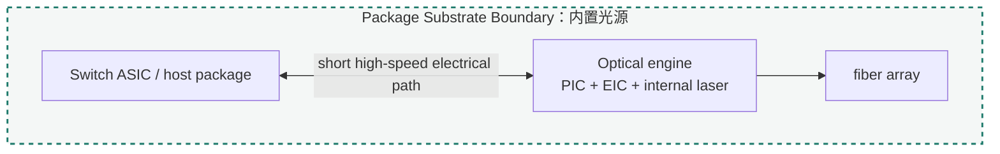
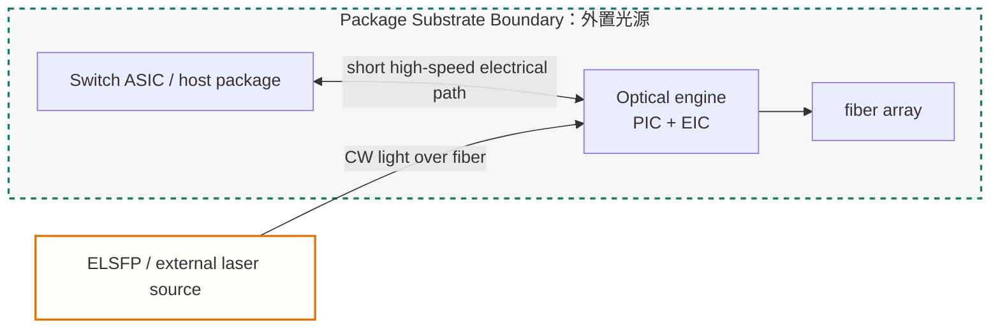

import TermNote from "../../components/TermNote.astro";

## 封装集成把光引擎变成系统部件

<TermNote label="Package integration" note="封装集成。它把多颗裸片、封装基板、光学接口、散热结构、机械固定和测试条件组织成可装配、可验证、可长期运行的产品形态。" /> 处理的是“这些部件怎样共同成立”。激光源、PIC、EIC、光纤阵列、连接器、封装基板、中介层、散热器和测试结构都已经有各自的设计目标；封装集成要把它们放进同一个空间、同一个温度场和同一套制造流程。

CPO 的直接动机是缩短 switch ASIC 与 optical engine 之间的高速电路径。电路径缩短以后，许多原本位于可插拔模块内部的约束会进入主封装附近：光纤如何出来、激光器放在哪里、EIC 怎样贴近 PIC、散热器如何压住热源、应力怎样传到波导、哪些裸片值得进入封装、失效后还能替换什么。

```text
Switch ASIC / host package
→ high-performance substrate or interposer
→ EIC / driver / TIA
→ PIC / modulator / PD / MUX
→ laser source or external CW light input
→ fiber array / connector / optical interface
→ heat spreader / lid / cold plate / chassis
```

激光器结构见 [激光源](../laser-source/)；片上光路见 [PIC / optical circuit](../pic/)；driver、TIA 和电接口见 [EIC / driver and receiver](../eic/)；coupler、FAU 和连接器见 [Optical interface / fiber coupling](../optical-io/)；KGD、封装级测试和量产筛选见 [Manufacturing and test](../manufacturing-test/)。

相关基础页：[Why photonic packaging is hard](../../learn/why-photonic-packaging-is-hard/)、[Inside a transceiver](../../learn/inside-a-transceiver/)、[SOI and Photonics-SOI](../../learn/soi-and-photonics-soi/)。

## ASIC Host Boundary 表示系统分工

OIF 文档中的 <TermNote label="ASIC Host Boundary" note="OIF CPO 语境中的英文接口名，可理解为主机 ASIC / host package 与 optical engine、基板、管理和测试责任之间的系统分工与接口范围。" /> 帮助定义 optical engine 靠近 host 到什么程度，也帮助说明高速电接口、管理接口、供电、散热、返修和测试责任由谁承担。它常出现在系统框架图中，实际封装里对应的是多种物理实现：共同封装基板、socket、near-package optics 或前面板可插拔模块。

| 架构形态 | 典型结构 | 主要收益 | 主要约束 |
|---|---|---|---|
| soldered CPO engine | optical engine 直接焊接到共同封装基板 | 电路径短、密度高、寄生可控 | 返修难度高，KGD 和装配良率压力集中 |
| socketed engine | engine 通过 LGA / socket / 压紧固定结构接入 | 可替换性较好，适合试产和返修 | 机械结构占面积，接触可靠性和通道密度受限 |
| near-package optics | engine 靠近 ASIC package，保留独立装配空间 | 主封装风险较低，维护空间较多 | 电路径长于深度 CPO，功耗收益较小 |
| front-panel pluggable | 光模块位于前面板 | 可维护性和生态成熟度高 | PCB 高频损耗、前面板密度和功耗压力更大 |

封装架构的差异，本质上是在电路径长度、封装面积、接触可靠性、散热路径、可测试性、返修能力和现场服务之间分配工程余量。

## 封装平面布局：电最短、光可出、热可走、力可控

<TermNote label="封装平面布局" note="floorplan，在封装平面上安排 ASIC、PIC、EIC、光源、光纤阵列、连接器和散热结构的位置关系。" /> 是 CPO 封装的起点。每个对象都有理想位置，但这些理想位置会互相挤压。

- EIC 希望贴近 PIC 的调制器电极和 PD pad，以降低 RF 路径损耗、寄生电容和时延偏斜。
- PIC 需要一侧面对 EIC 的高速 pad / microbump，另一侧面对光学接口的 coupler 或封装光路。
- 激光源希望靠近 PIC 以降低光损耗，同时避开高温区域，并保留测试、分档和可替换策略。
- FAU 和连接器希望靠近封装边缘，并保留光纤弯曲半径、应力释放、清洁和出纤空间。
- Switch ASIC 希望 optical engine 围绕它高密度排布；冷板、lid 和 TIM 希望热路径短、直、接触稳定。

```text
                 heat spreader / lid
                         |
Switch ASIC - substrate / interposer - EIC
                                      | microbump / RF pads
                                    PIC - edge coupler - fiber array
                                      |
                         internal laser or external CW input
```

一个看似很短的 RF 路径，可能把 EIC 热源放到 PIC 温敏器件旁边；一个利于出纤的 FAU 位置，可能占掉散热器或压紧框架的空间；一个利于返修的 socket，可能增加电接触长度和封装面积。成熟的封装布局会把这些冲突量化为 lane loss、热阻、warpage、coupling tolerance、test access 和 rework path。

## 封装基板与中介层承担高密度互连

<TermNote label="封装基板" note="package substrate，封装中承载电源、地、高速线、控制信号、BGA / LGA 接口和机械支撑的基板。封装语境下通常不把 substrate 译成“衬底”。" /> 是 CPO 的电气和机械底座。它要承载高速差分线、电源和地、控制信号、测试点、BGA / LGA 接口、socket 或 engine attach 结构。封装基板的线宽 / 间距、介质损耗、平整度和热机械性质，会限制 optical engine 能靠近 ASIC 到什么程度。

<TermNote label="中介层" note="interposer，位于芯片与封装基板之间的高密度互连层，可用硅中介层、RDL、TSV 或局部 bridge 把细 pitch 接口过渡到封装基板。" />、bridge、fan-out / RDL 和 engine substrate 用来提高局部互连密度，并把细 pitch microbump 过渡到系统可装配尺度。

| 层级 | 主要作用 | CPO 关注点 |
|---|---|---|
| organic package substrate | 电源、地、高速线、BGA / LGA、机械支撑 | 大面积和成熟度较好；line / space 和 pitch 限制更强 |
| silicon interposer | 高密度 die-to-die routing、TSV、细 pitch 过渡 | 密度高；成本、热、面积和应力需要权衡 |
| bridge / local interconnect | 局部高密度互连 | 适合关键 die 间短通道；布局和贴装流程相关 |
| fan-out / RDL | 重布线与 pitch 过渡 | 有利于多 die 重布线；翘曲和光学装配窗口要控制 |
| engine substrate | 承载 PIC / EIC / laser 的子基板 | 直接影响 RF 路径、laser attach、fiber attach 和预组装测试 |

Amkor 的 flip-chip 和 2.5D/HDFO 资料、ASE 的 2.5D/3D 封装资料都指向同一件事：封装既要固定芯片，也要把多个裸片之间的互连密度、供电、散热和机械公差组织起来。

## 裸片贴装决定寄生、应力和良率

<TermNote label="倒装互连" note="flip-chip，裸片正面朝下，通过焊球、铜柱或微凸点直接连接到基板或中介层，比引线键合路径更短、I/O 密度更高。" />、<TermNote label="铜柱" note="copper pillar，一种倒装凸点结构，常用于细 pitch、低电感和较好电迁移能力的高密度互连。" />、<TermNote label="微凸点" note="microbump，用于细 pitch die-to-die 或 die-to-interposer 连接的小尺寸凸点。" /> 和 <TermNote label="底填" note="underfill，填充在裸片与基板之间的聚合物材料，用于分担热膨胀差异带来的焊点应力。" /> 服务于同一目标：让更多 I/O 在更短距离内连接。

短互连能降低寄生电感和寄生电容，对 100G 以上电通道、driver 到 modulator、PD 到 TIA 都很重要。高密度互连也把材料问题带到光学器件旁边：bump pitch、standoff、coplanarity、underfill modulus、CTE、electromigration 和 keepout zone 会共同影响 RF 性能、焊点可靠性、PIC 应力和光纤耦合稳定性。

<TermNote label="混合键合" note="hybrid bonding，铜-铜直接连接与介质键合同时形成的高密度连接方式，可在更小间距下堆叠芯片并降低互连寄生。" /> 是更先进的垂直互连路线。TSMC 2024 Annual Report 对 SoIC 和 COUPE 的描述可作为技术例子：电芯片可通过 SoIC 与光子芯片堆叠，形成更短的 EIC-PIC 互连。它说明先进封装正在把光、电、热、机械和测试更紧地绑在一起；具体平台能力仍要按 PDK、封装规则、良率和客户产品来评估。

## 热路径和机械应力会改变光学指标

CPO 把多个热源放在同一区域：switch ASIC、EIC、激光器、PIC heater、power delivery 和控制电路都会改变温度场。热路径可以简化为：

```text
die junction
→ die attach / bumps / underfill / backside
→ substrate / interposer / heat spreader
→ TIM
→ lid / cold plate / heat sink
→ airflow or liquid loop
```

| 热源或应力源 | 封装关注点 | 可能影响 |
|---|---|---|
| switch ASIC | 高热通量、冷板接触、lid planarity | 限制 optical engine 放置区域和局部温度场 |
| EIC | driver / TIA 发热，贴近 PIC | 调制器漂移、PD 噪声、RF 性能和 bump 可靠性 |
| laser | 结温、热阻、输出功率和老化 | 波长漂移、PCE 下降、RIN 和寿命余量 |
| PIC heater | 调谐功耗、热串扰、反馈控制 | WDM channel drift、ring lock、startup calibration |
| underfill / epoxy / solder | CTE、固化收缩、模量和热循环 | solder fatigue、PIC stress、warpage、coupling drift |
| fiber attach | 光纤弯曲、拉力、胶材和端面 | 插损变化、回波损耗、长期机械稳定性 |

光子封装里的机械应力会直接变成光学问题。微小位移能改变 edge coupler loss；局部应力能改变 waveguide effective index；underfill 或 epoxy 固化收缩能改变 FAU 与 coupler 的相对位置；socket retention force 能影响 LGA 接触，也能改变封装基板平整度。热、机械和光学需要在同一个验证闭环里处理。

## 光源和出纤位置改变热、损耗和可维护性

光源位置是封装架构选择。光源可以在 optical engine 内部、封装边缘、独立 laser tile、异质集成区域，或外置 ELS / ELSFP 模块中。

| 光源放置 | 主要收益 | 主要代价 |
|---|---|---|
| optical engine 内部 | 光路短，连接器少，集成关系清晰 | laser 受 ASIC / EIC 热影响，KGD 与返修压力集中 |
| 封装边缘或 laser tile | 兼顾短光路和局部热隔离 | 光耦合、热沉、测试和装配流程更复杂 |
| 外置 ELS / ELSFP | 光源远离 ASIC 热源，可现场更换，便于独立管理 | 连接器、偏振、反射、安全、fiber routing 和光功率预算更复杂 |
| III-V-on-Si / bonded laser | 光路最短，集成度高 | 工艺整合、可靠性、热和规模量产难度高 |


```mermaid
graph LR
    subgraph Substrate_A ["Package Substrate Boundary：内置光源"]
        direction LR
        ASIC_A["Switch ASIC / host package"] <-->|short high-speed electrical path| OE_A["Optical engine<br/>PIC + EIC + internal laser"]
        OE_A --> FAU_A["fiber array"]
    end

    style Substrate_A fill:#f4f7f6,stroke:#1d7a6b,stroke-width:2px,stroke-dasharray:5,5
```


```mermaid
graph LR
    subgraph Substrate_B ["Package Substrate Boundary：外置光源"]
        direction LR
        ASIC_B["Switch ASIC / host package"] <-->|short high-speed electrical path| OE_B["Optical engine<br/>PIC + EIC"]
        OE_B --> FAU_B["fiber array"]
    end

    ELS["ELSFP / external laser source"] -->|CW light over fiber| OE_B

    style Substrate_B fill:#f4f7f6,stroke:#1d7a6b,stroke-width:2px,stroke-dasharray:5,5
    style ELS fill:#fffdf9,stroke:#d97706,stroke-width:2px
```

光学接口在封装页里承担系统接口角色：出纤方向、package edge、fiber bend radius、strain relief、blind-mate connector、cleaning access 和 front-panel / chassis routing。Edge coupler、grating coupler、lens 和 connector 的物理细节由 [Optical interface / fiber coupling](../optical-io/) 页面展开。

## KGD 与返修决定封装能承受多少风险

CPO 封装的经济风险来自高价值部件聚集。switch ASIC、PIC、EIC、laser、fiber array、substrate 和 assembly 都有自身良率；这些良率会在封装级累乘。

```text
package yield
≈ ASIC yield
× PIC KGD yield
× EIC KGD yield
× laser KGD yield
× substrate yield
× assembly yield
× optical alignment yield
× package-level test yield
```

<TermNote label="KGD" note="known good die，已知良品裸片。它表示裸片通过了约定覆盖范围内的测试筛选，适合进入更高价值的封装流程。" /> 的价值在于提前拦截风险。封装越贵、返修越难，封装前筛选越重要。PIC 需要 wafer-level optical test 和 die sort；EIC 需要电学、高速和管理接口测试；laser 需要功率、光谱、RIN、SMSR、热和老化分档；FAU 与 optical subassembly 需要插损、几何和端面质量检查。

| 结构 | 返修能力 | 良率含义 |
|---|---|---|
| soldered engine | 拆卸风险高，返修空间有限 | 依赖 KGD、装配良率和 package-level test 覆盖 |
| socketed engine | 可替换性较好 | retention、接触可靠性和面积换取返修能力 |
| external laser / ELSFP | 光源可现场更换 | laser 良率与主封装解耦，光连接和管理更复杂 |
| pre-assembled optical engine | 可在进入 ASIC package 前测试 | engine 成为可筛选子组件，增加子装配流程 |

成熟制造依赖数据闭环：wafer map、bump inspection、fiber alignment log、thermal test、BER / eye data、failure analysis 和 field return 数据要能回到设计规则、工艺窗口和供应链分档。

## 接口合同让相邻团队可以并行工作

封装页最终收束到一组接口合同。每个接口都有几何、电学、光学、热学和可靠性条件。

| 接口 | 典型指标 | 主要协作对象 |
|---|---|---|
| ASIC ↔ substrate / interposer | channel loss、return loss、crosstalk、power integrity、BGA / LGA pitch | host / ASIC / board |
| EIC ↔ PIC | RF path length、impedance、bump pitch、pad capacitance、ground return、skew | EIC 与 PIC |
| PIC ↔ fiber array | coupling loss、alignment tolerance、PDL、back reflection、pitch、thermal drift | Optical interface |
| laser ↔ PIC | coupled power、PER、reflection tolerance、thermal resistance、wavelength margin | 激光源、PIC、operations |
| package ↔ thermal solution | thermal resistance、junction temperature、hot spot、TIM void、lid flatness | system thermal |
| package ↔ mechanical system | warpage、CTE match、shock / vibration、strain relief、socket force | mechanical / reliability |
| package ↔ test / operations | KGD coverage、monitor telemetry、fault isolation、rework path、field replaceability | Manufacturing/Test 与 Reliability |

判断一个 CPO 封装方案时，应看它能否在目标速率、光功率预算、热路径、机械稳定、KGD、返修和现场服务之间留下工程余量。单项材料或单张封装截面图都不足以说明方案成熟；可重复装配、可测试、可追溯和可运营，才是封装集成的最终交付。

进一步阅读：

- [OIF: Co-Packaging Framework Document](https://www.oiforum.com/wp-content/uploads/OIF-Co-Packaging-FD-01.0.pdf)
- [OIF: External Laser Small Form Factor Pluggable Implementation Agreement](https://www.oiforum.com/wp-content/uploads/OIF-ELSFP-01.0.pdf)
- [OIF: Management of External Light Sources and Co-Packaged Optical Engines](https://www.oiforum.com/wp-content/uploads/OIF-MGT-Co-Packaging-ELSFP-01.0.pdf)
- [Amkor: Flip Chip Packaging](https://amkor.com/wp-content/uploads/2018/02/Flip_Chip_TS102.pdf)
- [Amkor: Copper Pillar Flip Chip](https://amkor.com/wp-content/uploads/2018/02/Copper_Pillar_Flip_Chip_TS106.pdf)
- [Amkor: 2.5D Package and HDFO technical article](https://amkor.com/wp-content/uploads/2018/12/Amkor_2.5D_Package_and_HDFO_Technical_Article_EN.pdf)
- [ASE: Silicon Photonics](https://ase.aseglobal.com/silicon-photonics/)
- [ASE: 2.5D and 3D IC Packaging](https://ase.aseglobal.com/3d-ic-packaging/)
- [TSMC 2024 Annual Report](https://investor.tsmc.com/static/annualReports/2024/english/ebook/files/basic-html/page102.html)
- [Ansys and TSMC Enable a Multiphysics Platform for Optics and Photonics](https://investors.ansys.com/news-releases/news-release-details/ansys-and-tsmc-enable-multiphysics-platform-optics-and-photonics/)
